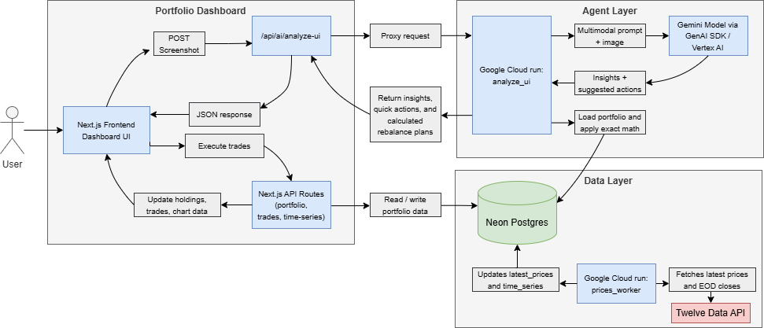

# Allocentra AI

Allocentra AI is a multimodal portfolio copilot. The app combines a portfolio dashboard, trade ledger, market data ingestion, and a Gemini-powered UI agent that analyzes a screenshot of the dashboard and returns insights plus executable actions.

Try it out: [https://allocentra-ai.vercel.app/](https://allocentra-ai.vercel.app/)

## Hackathon Fit

Allocentra AI is built for the `UI Navigator` category.

- It uses a `Gemini` model through the `Google GenAI SDK`
- It accepts a multimodal input: a screenshot of the live dashboard
- It returns more than text: insights, quick UI actions, and mathematically calculated rebalance trades
- The agent backend is hosted on `Google Cloud Run`

## Architecture

The architecture is organized into three layers:

1. `Portfolio Dashboard`
   - The user interacts with the `Next.js` dashboard hosted on `Vercel`
   - The frontend renders portfolio analytics and triggers AI screenshot analysis
   - `Next.js` API routes handle portfolio reads, trade execution, and time-series queries
   - The frontend sends normal portfolio requests to these routes

2. `Agent layer`
   - The frontend posts dashboard screenshots to `/api/ai/analyze-ui`
   - That `Next.js` route proxies the request to the `analyze-ui` service on `Google Cloud Run`
   - The analyze-ui service on Google Cloud Run sends the dashboard screenshot to Gemini for visual analysis, combines the model output with the user’s live portfolio data from Neon Postgres, uses rebalance.js to turn strategic recommendations into executable trade plans, and returns insights, quick actions, and rebalance plans to the frontend.

3. `Data layer`
   - `Neon Postgres` stores symbols, trades, latest prices, and historical time-series data
   - Both the `Next.js` API routes and the `analyze-ui` Cloud Run service read from this database 
   - A separate `prices_worker` service on `Google Cloud Run` fetches latest prices and end-of-day closes from `Twelve Data`
   - The worker writes those updates back into `Neon Postgres` 



## Reproducible Testing Instructions

For the fastest evaluation, use the deployed app link above and verify these flows:

1. Open the app and confirm the dashboard loads portfolio value, chart history, holdings, industry allocation, and company-size allocation.
2. Select a different timeframe to inspect your portfolio's performance over time.
3. Expand a holding to inspect its trade ledger.
3. Add a manual trade and confirm the dashboard refreshes portfolio metrics.
4. Open the AI analyst and run screenshot-based analysis.
5. Validate that the agent returns:
   - insights
   - strategic rebalance actions
   - quick UI actions
7. Execute a quick action and confirm it interacts with the dashboard.
8. Execute a rebalance action and confirm it writes trades and updates the dashboard.

## Local Setup

### Prerequisites

- `Node.js` 20+
- `npm`
- A `Neon Postgres` database
- A deployed `analyze-ui` service on `Google Cloud Run`
- A deployed prices worker on `Google Cloud Run`
- A `Twelve Data` API key
- A Google Cloud project with access to `Gemini`

### Environment Variables

Create `.env.local` in the project root with:

```bash
DATABASE_URL=YOUR_NEON_DATABASE_URL
TWELVE_DATA_API_KEY=YOUR_TWELVE_DATA_API_KEY
NEXT_PUBLIC_BASE_URL=http://localhost:3000
ANALYZE_UI_BACKEND_URL=YOUR_CLOUD_RUN_ANALYZE_UI_URL
GOOGLE_CLOUD_PROJECT=YOUR_GOOGLE_CLOUD_PROJECT
GOOGLE_CLOUD_LOCATION=us-central1
GEMINI_MODEL=gemini-2.5-flash
```

## Run Locally

Install dependencies:

```bash
npm install
```

Start the app:

```bash
npm run dev
```

Open:

```text
http://localhost:3000
```

## Cloud Run Services

### Analyze UI Service

The Cloud Run `analyze-ui` service:

- accepts a dashboard screenshot
- sends it to `Gemini`
- normalizes the model output
- enriches the response with exactly calculated rebalance trades

Relevant files:

- `cloudrun/analyze_ui/index.js`
- `cloudrun/analyze_ui/portfolio.js`
- `cloudrun/analyze_ui/rebalance.js`

### Prices Worker

The prices worker:

- fetches live prices from `Twelve Data`
- backfills end-of-day closes
- writes updates into `Neon Postgres`

Relevant file:

- `cloudrun/prices_worker/index.js`

## Deployment Notes

- Frontend: `Vercel`
- Database: `Neon Postgres`
- Agent backend: `Google Cloud Run`
- Prices worker: `Google Cloud Run`

The repository includes a deploy helper for the `analyze-ui` service:

```bash
scripts/deploy.sh
```

## Tech Stack

- `Next.js`
- `React`
- `TypeScript`
- `Vercel`
- `Neon Postgres`
- `Google Cloud Run`
- `Gemini`
- `Google GenAI SDK`
- `Twelve Data API`
- `Recharts`
- `Tailwind CSS`
- `shadcn/ui`
